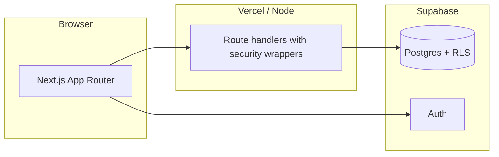

# barOS


**barOS** is the open-source operating layer for high-performing hospitality venues — the place where guest relationships, front-of-house execution, and back-office control finally share one source of truth. It is built for operators who have outgrown fragmented spreadsheets, siloed apps, and “good enough” tooling, and who want a single narrative from first touch to repeat visit.

Think of barOS as your **venue-wide nervous system**: capture signal at the door and the bar, turn it into insight in the office, and give every guest a reason to return — without bolting on yet another disconnected SaaS SKU.

## Why venues adopt barOS

- **One platform story** — CRM, loyalty, reservations, operations, and marketing workflows read from the same data model, so your team stops reconciling exports and starts acting on facts.
- **Revenue and retention in the same lens** — understand who visits, what they buy, how they engage with events, and how your floor and campaigns perform — without exporting to a third-party BI tool for every question.
- **Guest-grade experience** — a dedicated customer experience that feels intentional, on-brand, and fast on mobile — not an afterthought login tacked onto an admin product.
- **Operator-grade depth** — role-aware surfaces for staff, managers, and admins, with operational modules that mirror how real venues run shifts, inventory, procurement, and compliance.
- **Own your roadmap** — AGPL-3.0 for open use; self-host, fork, and extend. Commercial licensing is available when you need a proprietary distribution or white-label arrangement.

**Built for the bar. Ready for the whole venue.**

---

## Installable everywhere your guests already are (PWA)

barOS ships as a **Progressive Web App (PWA)** so your customer portal behaves like a first-class app without waiting on App Store or Play Store approval cycles.

- **iPhone and iPad (iOS)** — guests can use Safari to **Add to Home Screen** for a full-screen, app-like launcher experience with fast repeat access.
- **Android** — guests can **Install app** from Chrome (and compatible browsers) for the same home-screen, low-friction pattern they expect from native clients.
- **Offline-aware UX** — dedicated offline shell (`/~offline`) so spotty Wi‑Fi in the basement bar or the patio does not strand the experience.
- **Web push foundation** — project includes web push plumbing for operational and engagement notifications as you choose to enable them.

You keep **one codebase** for mobile web, installed PWA, and desktop — fewer branches to test, fewer “mobile vs desktop” feature gaps, and a faster path from idea to production.

---

## Complete capability map

Below is the **full surface area** of the product as reflected in the application today — from guest-facing journeys to deep operational modules.

### Customer portal (guest-facing)

- **Dashboard** — at-a-glance loyalty and engagement.
- **Bookings** — view and manage reservations tied to the guest.
- **Check-in** — venue and flow-aware check-in experiences.
- **Events** — browse programming and participate in the event lifecycle.
- **Loyalty** — points, status, and progression in plain language.
- **Rewards** — discover, understand, and redeem perks.
- **Menu** — browse offerings in a mobile-first layout.
- **Profile** — self-service identity and preferences.
- **Socials** — connect the guest-facing social layer to your venue story.

### CRM, service & commercial front office

- **Analytics** — venue analytics for trends and performance.
- **Bookings** — staff-side reservation pipeline and detail views.
- **Calendar** — time-based planning across service and events.
- **Customers** — profiles, history, segmentation inputs, and **customer detail** drill-down.
- **Loyalty forecast** — forward-looking loyalty and engagement signals for CRM decisions.
- **Visits** — visit history, patterns, and operational hooks.
- **Feedback** — structured capture of guest sentiment.
- **Referrals** — growth and advocacy mechanics.
- **Rewards (staff)** — administer and align rewards with policy.
- **Menu (public browse)** and **menu management** — from curated guest menu to back-office structure, modifiers, and costing discipline.
- **Menu cost calculator** — margin and plate-economics thinking without leaving the OS.
- **Inventory** — stock positions, **inventory detail**, and **inventory logs** for traceability.
- **Marketing** — campaign and channel thinking in-product, plus **marketing revenue estimator** for scenario planning.
- **Socials (staff)** — operational social publishing and coordination.

### Events, templates & on-premise moments

- **Events** — lifecycle, detail pages, and operational hooks.
- **Event templates** — list, **detail**, **create**, and **edit** reusable event blueprints.
- **Event check-in** — dedicated **check-in routes** for event-scoped arrival (`/checkin/[eventId]`).

### People, time & tasks

- **Staff** — roster concepts, invitations, and staff administration.
- **Schedule** — shifts and coverage planning.
- **Tasks** — work tracking that survives the noise of a real service week.
- **Profile** — operator profile and preferences.

### Command dashboards

- **Dashboard** — operational command center.
- **Dashboard — events** — event-centric slice for busy nights.
- **Dashboard — financial** — financial rollups for leadership.
- **Dashboard — inventory** — stock and variance visibility for managers.
- **Dashboard — marketing** — connect growth activity to operational reality.

### Operations suite (floor, line & back office)

- **Operations hub** — front door into the operational module set.
- **Point of sale & service** — **checkout**, **KDS** (kitchen display), **BDS** (bar display), **orders**, **tables**, **occupancy**, **stock control**.
- **Menu engineering** — profitability and mix discipline tied to real menu data.
- **Pricing** — structured pricing windows and controls.
- **Procurement** — purchasing and receiving workflows.
- **Receipts** — receipt-level traceability for audits and service recovery.
- **Gift cards** — issuance and redemption flows.
- **Event commerce** — ticketing and event-adjacent commerce.
- **Memberships** — plans, assignment, and status.
- **Consents** — consent capture and listing aligned to operational and regulatory needs.
- **Customer comms** — operational communications surface.
- **Integrations** — third-party and internal integration status and controls.
- **Offline sync** — batch-oriented resilience for flaky connectivity environments.
- **Locations** — multi-location and floor discipline.
- **Staff time** — time tracking hub with **timesheets**, **anomalies**, and **payroll**-oriented reporting entry points.
- **Checklists** — turn recurring operational excellence into accountable lists.
- **Admin RBAC** — role-based access control administration.

### Trust, privacy & onboarding surfaces

- **Landing** — public storytelling and entry.
- **Login / register** — secure auth flows.
- **Auth callback** — OAuth and provider return handling.
- **Privacy** — published privacy posture for guest and operator trust.

### APIs and platform depth

Beyond pages, barOS exposes a **large route-handler API surface** (bookings, customers, events, inventory, marketing, menu, operations, GDPR tooling, integrations, push, rewards, RSVPs, schedule, staff, tasks, visits, waitlist, and more) so you can integrate kiosks, partners, and custom channels without forking the core model.

---

## Product screenshots

Images live under [`public/screenshots/`](./public/screenshots/) so they render on GitHub and are served at `/screenshots/...` when the app runs.

### Customer portal (guest perspective)

| | |
| --- | --- |
|  |  |
|  |  |
|  |  |
|  |  |
|  | |

### Staff and operations (admin perspective)

| | |
| --- | --- |
|  |  |
|  |  |
|  |  |
|  |  |
|  |  |
|  |  |
|  |  |
|  |  |
|  |  |
|  |  |

---

## Architecture (high level)



---

## Tech stack

- **Application** — Next.js 15, React 19, TypeScript, App Router.
- **Data & auth** — Supabase (Postgres, Auth, row-level security).
- **UI** — Tailwind CSS, Radix primitives, shadcn-style component patterns.
- **Quality** — Jest, Testing Library, accessibility and security-oriented test suites.
- **Observability** — Sentry-ready instrumentation for server, client, and edge.
- **PWA** — Serwist / service worker pipeline for installability and offline shell.

---

## Quick start

```bash
git clone https://github.com/stoimenovskiv/BarOS.git
cd BarOS
npm install
npm run dev
```

Copy the environment template before running:

- Windows (PowerShell): `Copy-Item .env.example .env.local`
- macOS/Linux: `cp .env.example .env.local`

Then apply schema files in order inside the Supabase SQL editor:

`schemas/01-extensions.sql` through `schemas/11-seed-demo-users.sql`

Full setup: [`docs/QUICKSTART.md`](./docs/QUICKSTART.md)

---

## Setup flow (detailed)

1. Create a Supabase project.
2. Copy `.env.example` to `.env.local`.
3. Fill required values in `.env.local`:
   - `NEXT_PUBLIC_SUPABASE_URL`
   - `NEXT_PUBLIC_SUPABASE_ANON_KEY`
   - `SUPABASE_SERVICE_ROLE_KEY`
4. Run schema files in order (`schemas/01` to `schemas/11`) from the Supabase SQL editor.
5. Start the app with `npm run dev`.
6. Open `http://localhost:3000` and log in with demo credentials.

---

## Demo credentials

Only demo credentials are published:

- Admin: `admin@example.com` / `admin123`
- Customer: `customer@example.com` / `customer123`

Defined in `schemas/11-seed-demo-users.sql`.

---

## Useful scripts

- `npm run dev` — start local app
- `npm run dev:turbo` — start dev server with Turbopack
- `npm run build` — production build
- `npm run start` — run production build locally
- `npm run test` — run Jest test suite
- `npm run test:ci` — CI tests
- `npm run verify:schema` — verify canonical schema parity with CSV source
- `npm run verify:secrets` — scan tracked files for credential leaks
- `npm run verify:all` — run all quality, security, and schema checks

---

## Deployment and environment

Required production environment variables are documented in [`docs/deployment/environment.md`](./docs/deployment/environment.md).

---

## Troubleshooting

- **App fails on startup**: check `.env.local` values and the Supabase project URL and key pair.
- **Auth or permission errors**: re-apply `schemas/08-rls-policies.sql` and confirm the full schema sequence was applied.
- **Schema verify fails**: regenerate canonical schema from CSV using `node scripts/tools/generate-canonical-schema-from-csv.mjs "<path-to-csv>"`
- **CI verify fails**: run `npm run verify:all` locally to identify the first failing check.

---

## Project structure

- `src/` — application routes, UI, APIs, stores, and libraries
- `schemas/` — canonical SQL schema, policies, and seed files
- `scripts/verify/` — verification checks used in CI
- `docs/` — architecture, quickstart, security, and deployment documentation

---

## Contributing and security

- Contributing: [`CONTRIBUTING.md`](./CONTRIBUTING.md)
- Security policy: [`SECURITY.md`](./SECURITY.md)
- Code of conduct: [`CODE_OF_CONDUCT.md`](./CODE_OF_CONDUCT.md)
- Open-source use under AGPL-3.0
- Commercial use requires a paid license from the maintainer
- Details: [`LICENSE`](./LICENSE) and [`COMMERCIAL_LICENSE.md`](./COMMERCIAL_LICENSE.md)
